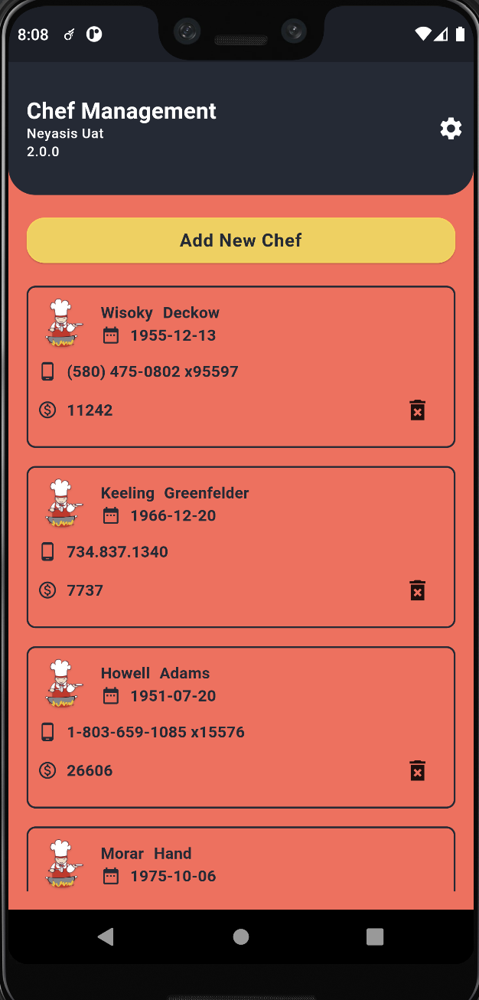
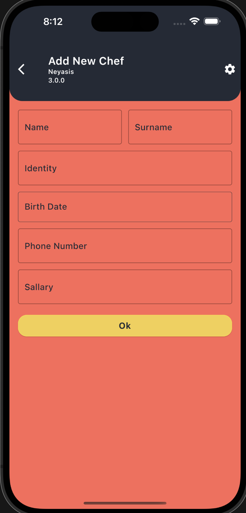

# CHEF CRUD MOCK IO 🌱

## VERSIONS

Instructions on how to use them in your own application are linked below.

| Name         | Version |
|--------------|---------|
| Flutter      | 3.0.5   |

## Used Library

For State Management
# navigation
1.go_router: ^4.5.1

# dependency injection
1.get_it: ^7.2.0
2.injectable: ^1.5.3

# generate json method
1.json_annotation: ^4.7.0
2.json_serializable: ^6.3.1

# rest api
1.retrofit: ^3.0.0
2.dio: ^4.0.3

# State Management
1.provider: ^6.0.2
2.mobx: ^2.0.6+1
3.mobx_codegen: ^2.0.5+2
4.flutter_mobx: ^2.0.4

## Installation

1. flutter pub get
2. flutter pub run build_runner build --delete-conflicting-outputs

## For IOS
1. cd ios && pod install

## SS

